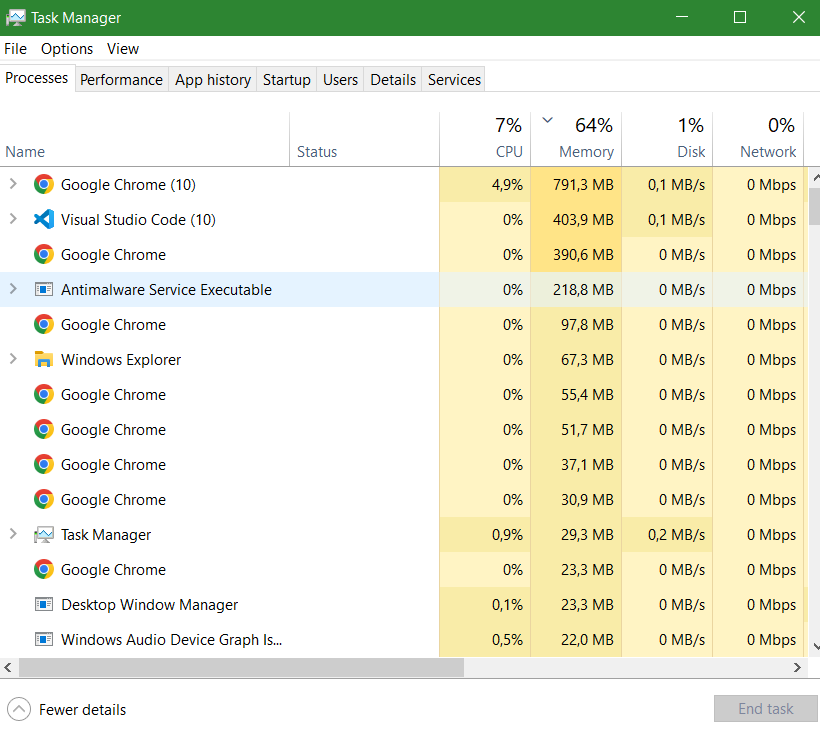
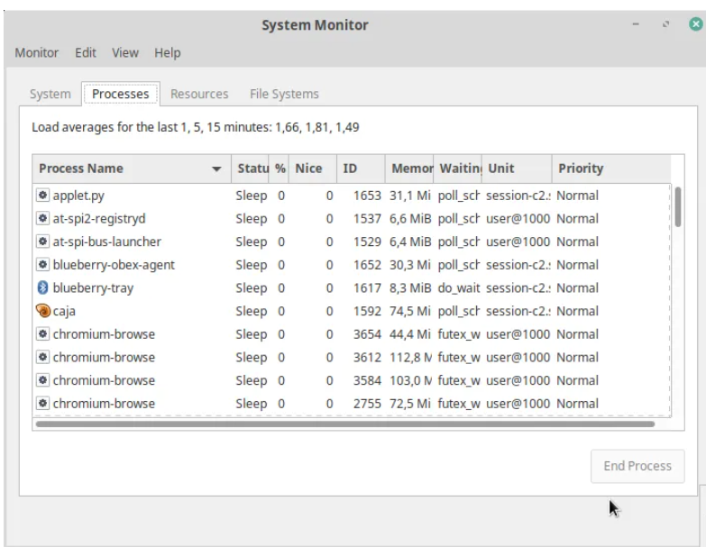
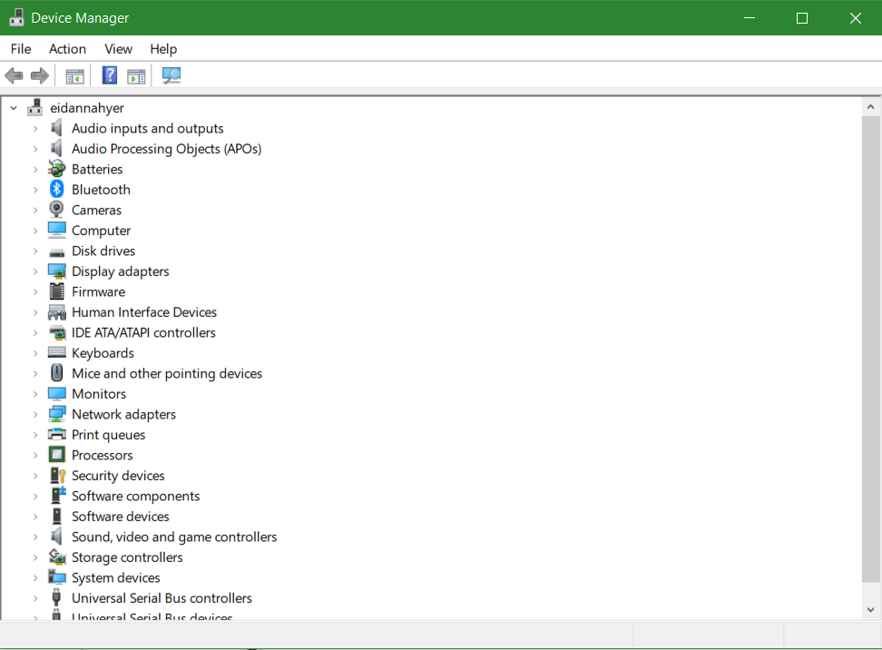
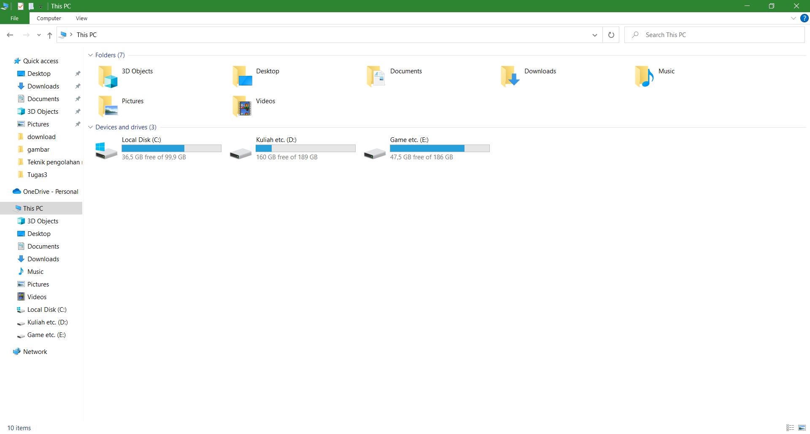

# Komponen Sistem Operasi

## 1. Manajemen Proses 

__Manajemen proses__ adalah suatu cara atau tindakan dalam membagi, mengalokasikan program yang akan dieksekusi menjadi tidak berantakan dan berjalan dengan baik sebagai mana mestinya. Dalam fungsinya untuk mengembangkan dan meningkatkan derajat efisiensi dan efektivitas, manajemen proses juga merupakan salah satu perangkat kerja yang sangat potensial dalam upaya peningkatan nilai-nilai kepuasan konsumen.

### Manajemen proses pada windows dan linux :
#### Windows

#### Linux

## 2.Manajemen Memori Utama

__Memori manajemen__ adalah tindakan mengelola memori komputer. Kebutuhan utama manajemen memori adalah untuk menyediakan cara untuk secara dinamis mengalokasikan bagian-bagian dari memori untuk program atas permintaan mereka, dan membebaskan untuk digunakan kembali ketika tidak lagi diperlukan. Ini sangat penting untuk setiap sistem komputer canggih di mana lebih dari satu proses mungkin berlangsung setiap saat.
### Manajemen memori utama pada windows dan linux :
#### Windows

#### Linux

Grafik menunjukan penggunaan memori pada komputer yang sedang kita gunakan.

## 3. Manajemen sistem Input Output (I/O)

I/O adalah suatu mekanisme pengiriman data secara bertahap dan terus menerus melalui suatu aliran data dari proses ke peranti (begitu pula sebaliknya). Fungsi I/O Pada dasarnya adalah mengimplementasikan algoritma I/O pada level aplikasi. Pada dasarnya, tugas utama komputer adalah processing dan I/O (Input danOutput). Bahkan sebagian besar waktunya digunakan untuk mengolah I/O sedangkan processing hanya bersifat insidental. Jadi, pada konteks I/O, peranan sistem operasi adalah mengatur dan mengontrol perangkat I/O dan operasi I/O.

### Manajemen i/o pada windows:
#### Windows

## 4. Manajemen sistem berkas

__Manajemen sistem berkas__ adalah sebuah metode dan struktur data yang digunakan oleh sistem operasi pada komputer untuk mengatur dan mengorganisir file yang ada pada disk atau partisi disk.

### Manajemen sistem berkas pada windows dan linux :
#### Windows

#### Linux

Diatas terlihat bahwa kita bisa mengatur menghapus memindahkan dan membuka file dan folder yang ada pada penyimpanan kita.