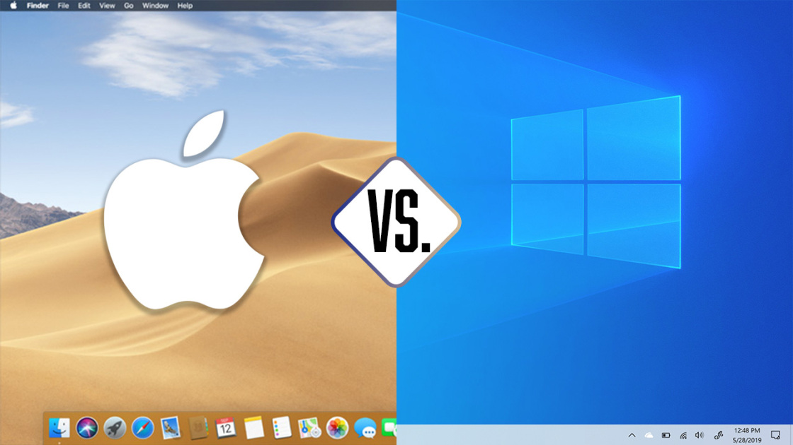
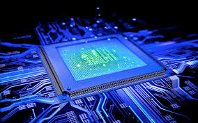
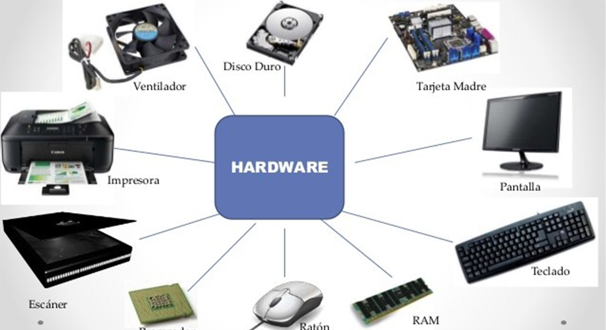

Halo! Kalian pasti pernah atau bahkan mempunyai __Personal Computer(pc)__ atau __laptop__, nah di kesempatan kali ini kita akan membahas seputar komputer loh dari pengertian, fungsi, sampai sejarah perkembangannya pun akan kita bahas loh. Mari kita simak pengertian dan penjelasannya.

# __PC/Laptop__
## Pengertian
Komputer atau PC adalah perangkat elektronik yang memanipulasi informasi, atau data. Ia memiliki kemampuan untuk menyimpan, mengambil, dan memproses data. Komputer dirancang untuk menjalankan aplikasi dan menyediakan berbagai solusi melalui komponen perangkat keras dan perangkat lunak yang terintegrasi.
 
### Pengertian komputer menurut William M. Fuori
> Komputer adalah alat pemroses data yang bisa melakukan perhitungan secara besar dan cepat, termasuk perhitungan aritmatika serta operasi logika, dan tidak ada campur tangan manusia.

 

# __Sistem Operasi__

## Pengertian
Sistem operasi komputer adalah program perangkat lunak atau software yang diperlukan untuk mengelola dan mengoperasikan perangkat komputasi seperti komputer, smartphone, atau tablet. Atau singkatnya Sistem Operasi adalah sebuah perangkat lunak yang __*menjembatani*__ antara pengguna, perangkat keras, dan perangkat lunak itu sendiri.
 
Contoh Sistem Operasi yang terkenal dan tentunya cukup banyak digunakan oleh banyak pengguna yaitu **WINDOWS** dan juga **MAC OS**.

 

# __Prosesor(Processor)__
## Pengertian
Prosesor adalah **komponen utama** atau otak dari laptop / komputer Anda. Prosesor terletak tepat di tengah motherboard. Prosesor memiliki fungsi yang penting bagi seluruh operasi perangkat komputer karena semua perintah dimulai dari processor.
 

## Kegunaan/fungsi
Fungsi processor secara umum adalah mengolah perintah yang masuk kemudian dikeluarkan berupa output yaitu pemberi perintah. Fungsi prosesor adalah:
1. Memastikan komputer bekerja dengan baik

2. Menjalankan proses informasi pada komputer

3. Memberikan perintah kepada tiap komponen komputer

4. Menjaga performa komputer

5. Menunjang kegiatan spesifik komputer

6. Mengolah perhitungan algoritma

7. Menjaga stabilitas komponen komputer

8.  Mendukung kebutuhan spesifik komputer

# __Software__
## Pengertian
Software atau *Perangkat Lunak* adalah data yang diprogram, disimpan, dan diformat secara digital dengan fungsi tertentu. Perangkat ini sendiri tidak memiliki bentuk fisik, Anda bisa mengoperasikannya lewat perangkat komputer. Untuk pembuatannya sendiri, perangkat ini memerlukan bahasa pemrograman yang ditulis oleh seorang pemrogram/orang yang ahli akan bidang tersebut. Selanjutnya, perangkat tersebut dikompilasikan memakai aplikasi kompiler agat dapat menjadi kode yang bisa dikenali oleh mesin hardware/ perangkat keras. Yang dimaksud hardware/perangkat keras disini adalah Personal Computer/komputer.

>Nah udah tau dong software itu apa? Betul banget, software itu sering kita gunain sehari-hari setiap kita memakai gadget kita loh! Seperti Microsoft Word, Kalkulator, bahkan game yang sering kalian mainkan itu termasuk software.

# __Hardware__
Nah tadi kan udah belajar dan tau tentang **Software** sekarang kita akan membahas lawan kata dari Software itu sendiri nih, yaitu __Hardware__, Yuk simak!

## Pengertian
Hardware atau yang lebih dikenal dengan sebutan perangkat keras adalah semua jenis komponen yang ada pada komputer yang mana bagian fisiknya dapat terlihat secara kasat mata atau dapat dirasakan secara langsung. Jadi bisa dikatakan jika hardware adalah peralatan fisik komputer yang berguna untuk melakukan proses input, proses, dan output.

Beberapa diantaranya seperti RAM, CPU, mouse, keyboard, scanner, monitor, printer, dan masih banyak lagi. Selain itu, hardware umumnya juga terlihat sebagai bentuk output dari setiap proses sistem operasi sebuah komputer. Akan tetapi untuk mendukung kerja perangkat tersebut tetap diperlukan software atau perangkat lunak tertentu. Dengan begitu setiap perintah yang diinginkan dapat beroperasi dengan baik.
 

# __Penyimpanan Primer dan Sekunder__
## Pengertian
Di komputer, terdapat 2 jenis penyimpanan yaitu Primer dan Sekunder, apa perbedaannya? Mari kita simak penjelasannya.

### __Penyimpanan Primer__
Memory primer, atau primary memory adalah penyimpanan pada komputer yang tertuju pada RAM (Random Access Memory) dan ROM (Read Only Memory) sebagian besar alokasinya adalah pada RAM. Disebut memori primer karena jenis memory ini diakses secara langsung dan pertama kali oleh processor saat mengeksekusi sebuah perintah.  Tipe memory ini kemudian disebut juga sebagai main memory.

Memory primer, terbuat dari bahan semikonduktor dan terhubung dengan processor lewat Port pada motherboard, sifatnya adalah volatile (untuk jenis RAM) yang artinya data yang ada di dalamnya akan hilang saat arus listrik padam. Memory primer dibutuhkan untuk pengalokasian memori pemrosesan data secara cepat, sehingga yang ditekankan adalah kapasitas process dan kecepatannya bukan keamanan penyimpanan datanya.
 

### __Penyimpanan Sekunder__ 
Memory sekunder atau Secondary memory adalah penyimpanan pada komputer yang tertuju pada HDD (Hardisk) yaitu sebagai alokasi/tempat tersimpannnya data-data kita. Disebut memori Sekunder  karena jenis memori ini data-data/ file yang ada di dalamnyadapat diakses dan tersimpan secara permanen selama tidak menghapusnya.

Memory sekunder, terbuat dari bahan cakram keras terdiri dari sebuah poros (spindle) yang menjaga putaran piringan (platter) tempat data disimpan. Piringan terbuat dari bahan non-magnetis, biasanya alumunium alloy, chip/ic dan Controller. sifatnya adalah nonvolatile (untuk jenis HDD,FDD) yang artinya data yang ada di dalamnya akan tersimpan meskipun arus listrik padam. contoh memory sekunder adalah Hardisk, flashdisk, Disket,CDR ,CDRW dan DVD.

Perbedaan memory primer dan memory sekunder wallpaper Memory sekunder tidak dapat langsung diakses oleh CPU, untuk mengakses data yang berada di dalamnya, maka data di memory sekunder dipindahkan ke memory primer, kemudian dibaca dan dieksekusi oleh processor.

 

# __Sejarah Perkembangan Komputer__

## Munculnya Komputer Pertama
Komputer pertama kali ditemukan pada 1822 oleh seorang ahli matematika asal Inggris, __Charles Babbage__. Mulanya, Babbage bermaksud untuk menciptakan sebuah mesin hitung bertenaga uap yang dapat menghitung tabel angka. Mesin tersebut kemudian ia beri nama __"Difference Engine 0"__ dan digadang-gadang sebagai komputer pertama di dunia. Bentuk Difference Engine 0 sendiri sangat jauh berbeda dari kebanyakan model komputer modern saat ini.
 

## Cikal bakal komputer digital
Cikal bakal komputer digital pertama dikembangkan pada 1930. Adalah __Alan Turing__ yang pertama kali mengembangkan mesin tersebut.Ia merupakan peneliti matematika yang sukses mengembangkan mesin yang dapat menjalankan sekumpulan perintah.Berkat kontribusinya, mesin tersebut kemudian diberi nama mesin Turing (Turing Machine), termasuk sebuah simulasi gagasannya yang bernama uji Turing.

Komputer digital pertama dikembangkan oleh Konrad Zuse, seorang insinyur mesin asal Jerman. Sebelum perang dunia kedua pecah, Zuse membangun komputer digital pertama bernama Z1 yang dapat diprogram.

Pada 1936 di ruang tamu orang tuanya di Berlin, ia merakit pelat logam, pin, dan menciptakan sebuah mesin yang dapat melakukan perhitungan tambah dan kurang.
 

## Lahirnya bahasa pemrograman
Pada 1954, bahasa pemrograman dicetuskan untuk pertama kalinya oleh ilmuwan komputer wanita bernama __Grace Hopper__. Bahasa pemrograman bernama COBOL ini hadir untuk membantu pengguna komputer dalam menyampaikan perintah dalam bahasa Inggris.

Selanjutnya, terciptalah bahasa pemrograman baru bernama __FORTRAN__, yang dikembangkan oleh tim pemrograman IBM yang dipimpin oleh John Backus pada tahun 1954.

Sampai pada 1965, komputer dikenal sebagai alat penunjang untuk para ahli matematika, insinyur, hingga masyarakat kalangan umum. Adapun komputer tersebut dikenal dengan nama Programma 101.
 

## Komputer Pribadi
Tahun 1970-an dapat dibilang sebagai era kelahiran komputer pribadi. Ditandai dengan munculnya Xerox Alto, sebuah komputer pribadi yang dapat menjalankan perintah seperti mengirimkan e-mail dan mencetak (print) dokumen. Satu hal yang paling beda dari Xerox Alto adalah desainnya yang sudah menyerupai komputer modern. Sebab, komputer ini telah dilengkapi dengan mouse, keyboard, serta layar.

Di tahun yang sama, beberapa penemuan besar turut terjadi. Beberapa di antaranya seperti diciptakannya disket, ethernet, serta chip Dynamic Access Memory (DRAM).

Sementara itu, Apple mulai didirikan pada tahun 1976 oleh Steve Jobs dan Steve Wozniak. Keduanya turut memperkenalkan Apple I, sebuah komputer single-circuit pertama.

Desain komputer pribadi kemudian disempurnakan oleh IBM, lewat sebuah perangkat bernama Acorn. Komputer ini sudah dilengkapi dengan chip Intel, dua slot disket, keyboard, serta layar monitor yang berwarna.

Berbagai penemuan lain kemudian ditemukan pada 1983. CD-ROM resmi hadir sebagai alat penyimpanan yang mampu menampung data hingga 550 MB. CD-ROM kemudian ditetapkan sebagai standar umum komputer.

Pada tahun yang sama, Microsoft resmi memperkenalkan Word, diikuti oleh Apple yang merilis Macintosh di tahun 1984. Macintosh dikenal sebagai komputer pertama yang dapat dikendalikan menggunakan mouse serta dilengkapi dengan antarmuka pengguna grafis.

Seakan tak mau ketinggalan, Microsoft turut meluncurkan sistem operasi Windows yang menawarkan keunggulan dari multi-tasking dan sudah dibekali dengan antarmuka grafis.

 

## Komputer era 2000-an
Memasuki abad ke-21, laju perkembangan perangkat komputer semakin pesat, seiring dengan perkembangan teknologi.

Penggunaan disket dan CD-ROM mulai tersisihkan oleh media penyimpanan portabel yang lebih canggih, yakni USB drive.

Sementara itu, Apple semakin gencar menelurkan inovasi terbaru lewat sistem operasi bernama Mac OS X. Microsoft pun sebagai kompetitor juga meluncurkan sistem operasi yang lebih modern, Windows XP.

Apple berhasil memimpin tren pasar berkat hadirnya iTunes. Kurang dari satu pekan setelah dirilis, aplikasi pemutar musik ini sudah digunakan untuk mengunduh lebih dari 1 juta judul lagu.

Beberapa aplikasi seperti YouTube, Mozilla Firefox, dan MySpace turut hadir di era modern ini.

Hingga pada 2006, tren penggunaan laptop semakin menjamur di masyarakat. Hal ini turut didorong oleh hadirnya perangkat laptop MacBook Pro yang diperkenalkan oleh Steve Jobs.
 

## Internet of things
Tahun 2011 ditandai sebagai tahun lahirnya berbagai penemuan Internet of Things (IoT). Nest Learning Thermostat yang hadir pada tahun ini kemudian dikenal sebagai perangkat IoT pertama di dunia.

Selanjutnya, berbagai produk IoT lainnya semakin menjamur di pasaran. Sebut saja seperti Apple Watch yang hadir pada 2015.

Untuk pertama kalinya, Apple turut mengumumkan iPadOS, sebuah sistem operasi yang dikhususkan untuk iPad.

